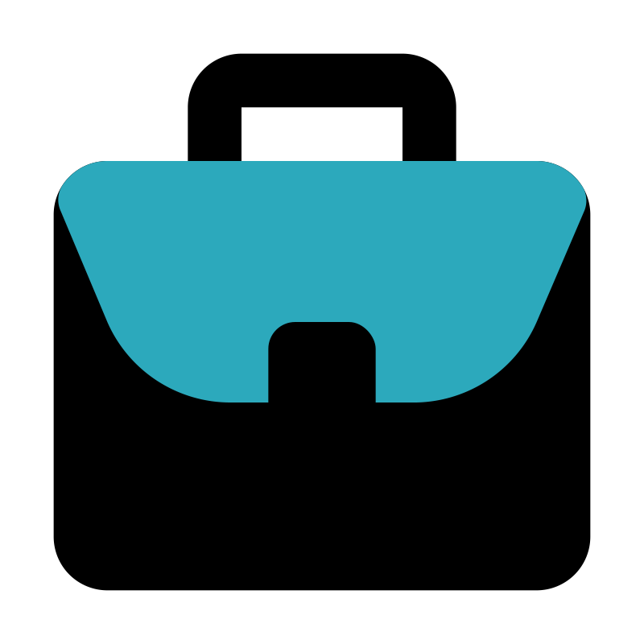

<h1>SKILLS</h1>
<h3 style="color:DodgerBlue;">Frameworks / Libraries</h3>
- Spring Boot, Spring MVC, Node.js, Express.js, Angular, React.js, Bootstrap, Jasmine, Protractor

### Programming / Scripting Languages
- Java, JavaScript, TypeScript, HTML, Python, SQL, Bash, Go Lang

### API
- XML, JSON, YAML, Protocol Buffers, REST, SOAP, gRPC, GraphQL, Swagger

### DevOps
- Dockers, Kubernetes, AWS, Azure, Jenkins, Git, Jira, Confluence, Istio, Envoy, Nginx, Apache Kafka, RedHat, Ubuntu

### Database
- MySQL, MongoDB, PostgreSQL, Neo4j, AWS DynamoDB, Redis

### Frameworks / Libraries
- Spring Boot, Spring MVC, Node.js, Express.js, Angular, React.js, Bootstrap, Jasmine, Protractor

### Programming / Scripting Languages
- Java, JavaScript, TypeScript, HTML, Python, SQL, Bash, Go Lang

### API
- XML, JSON, YAML, Protocol Buffers, REST, SOAP, gRPC, GraphQL, Swagger

### DevOps
- Dockers, Kubernetes, AWS, Azure, Jenkins, Git, Jira, Confluence, Istio, Envoy, Nginx, Apache Kafka, RedHat, Ubuntu

### Database
- MySQL, MongoDB, PostgreSQL, Neo4j, AWS DynamoDB, Redis

# CERITFICATIONS
---
- ### Certified Kubernetes Administrator (Scored: 100%)
- ### Oracle Certified Java Professional

  
  
  

  
  <h1 style="position: relative;
  top: 18px;
  left: 10px;">WORK EXPERIENCES</h1>

---
# EDUCATION
---
### Master of Applied Computer Science 
> **GPA:** 4.07 / 4.3 | **Duration:** 01/2020 – 08/2021 | **Institution:** Dalhousie University, Canada
#### Relevant Courses:
- Advanced Software Development (CI/CD, TDD, SOLID Principles, Design Patterns, Clean Coding Principles)
- Advanced Cloud Computing (Serverless, AWS, Azure, Distributed Transactions – 2PC / SAGA, Dockers, Kubernetes)
- Data Management (MySQL, NoSQL – MongoDB, Neo4j, Data Warehouse Design, Hadoop / Spark, Tableau)
- Machine Learning & Visual Analytics (Classification, Regression, Clustering, NLP, Neural Networks)

### Bachelors in Computer Science Engineering
> **GPA:** 8.46 / 10 | **Duration:** 04/2013 – 04/2017 | **Institution:** GITAM University, India
#### Relevant Courses:
- Data Structures & Algorithms
- Objected Oriented Design (UML)
- Database Management
- Operating Systems
- Computer Networks and Security (SSH, JWT, OAuth)

# ACADEMIC & PERSONAL PROJECTS

# AWARDS & RECOGNITIONS

